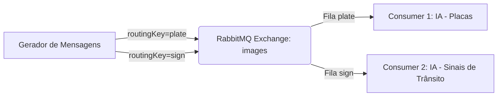

# ⚡ Sistema Distribuído com RabbitMQ, Java e IA

Este projeto implementa um **sistema distribuído em containers Docker** que utiliza **RabbitMQ como broker de mensagens** e dois consumidores com inteligência artificial embarcada usando a biblioteca **Smile**.  

O sistema gera uma carga constante de mensagens (imagens de placas de veículos e sinais de trânsito), roteia via RabbitMQ e processa em dois serviços consumidores distintos para identificação e classificação.

---

## 🎥 Demonstração

👉 [Assista no YouTube](https://youtu.be/6OCJDhu0gUk)

---

## 📦 Arquitetura do Sistema

O sistema possui **4 containers**:

1. **Gerador de Mensagens (Message Generator)**  
   - Gera mensagens rápidas (≥ 5 mensagens/segundo).  
   - Tipos de mensagens:  
     - **Placa de veículo** (routing key: `plate`).  
     - **Sinal de trânsito** (routing key: `sign`).  
   - Publica mensagens no **Exchange `images`** (Topic) do RabbitMQ.

2. **RabbitMQ**  
   - Atua como **broker de mensagens**.  
   - Usa **Topic Exchange** para rotear mensagens para os consumidores corretos baseado na routing key.  
   - Cada consumidor recebe somente o tipo de mensagem que está apto a processar.  

3. **Consumidor 1 (Consumer Plate)**  
   - Recebe mensagens de placas.  
   - Processa com IA (Smile) para classificar o tipo do veículo.
   - Simula um OCR para leitura dos caracteres da placa.  

4. **Consumidor 2 (Consumer Sign)**  
   - Recebe mensagens de sinais de trânsito.  
   - Processa com IA (Smile) para identificar o tipo de sinal (ex: pare, velocidade, planetas/temas específicos do dataset).  

---

## 🗂️ Estrutura do Projeto

```
.
├── Dataset_plates/       # Pasta com as fotos das placas (a ser criada/montada)
├── Dataset_signs/        # Pasta com as fotos dos sinais (a ser criada/montada)
├── consumerPlate/        # Serviço IA de identificação de placas
├── consumerSign/         # Serviço IA de identificação de sinais
├── messageGenerator/     # Serviço gerador de carga de mensagens
└── docker-compose.yml
```

---

## 🚀 Como Executar

### 1️⃣ Pré-requisitos
- [Docker](https://www.docker.com/)  
- [Docker Compose](https://docs.docker.com/compose/)  

### 2️⃣ Subir os containers
```bash
docker-compose up --build
```

### 3️⃣ Derrubar os containers
```bash
docker-compose down
```

---

## ⚙️ Tecnologias Utilizadas

- **Java 17**  
- **RabbitMQ** (mensageria distribuída com Topic Exchange)  
- **Docker + Docker Compose** (containerização)  
- **Smile** (biblioteca de Machine Learning em Java)  

---

## 📊 Fluxo de Mensagens



---

## 🤖 Exemplos de Saída

### Gerador de Mensagens
```
Imagem: feliz1.png | Timestamp: 1759519066567
Imagem: marte.png | Timestamp: 1759519066361
```

### Consumer Plate
```
[Placa Lida: XYZ-9876] Arquivo: feliz1.png | [Tipo do Veículo] Feliz
```

### Consumer Sign
```
[Arquivo] marte.png | [Sinal Detectado] Marte
```

> **Nota:** Como o processamento nos consumidores é configurado para ser mais lento que a geração (Thread.sleep de 2s), as filas no RabbitMQ tendem a encher, permitindo visualizar a carga no painel de gerenciamento (`localhost:15672`).
